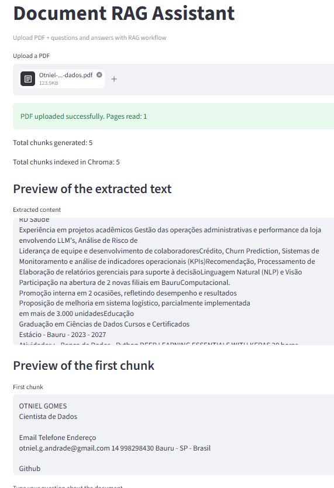
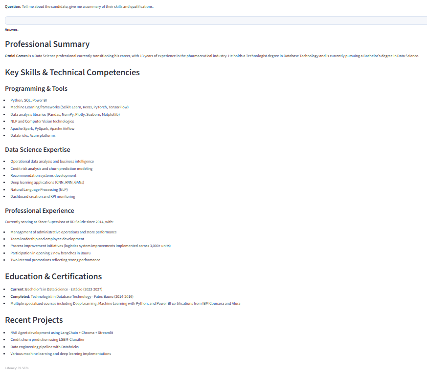
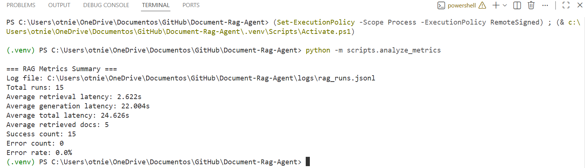

<a id="readme-top"></a>


[![Contributors][contributors-shield]][contributors-url]
[![Forks][forks-shield]][forks-url]
[![Stargazers][stars-shield]][stars-url]
[![Issues][issues-shield]][issues-url]
[![MIT License][license-shield]][license-url]
[![LinkedIn][linkedin-shield]][linkedin-url]

<br/>
<div align="center">
    
  
  <h1 align="center"> Document RAG Agent </h1>

  <p align="center">
    <h3>RAG-based PDF question-answering application built with Python, Streamlit, LangChain, and ChromaDB, focused on semantic retrieval, context-aware answers, and hallucination reduction.</h3>
    <br/>
    <a href="https://github.com/OtnielGomes/Document-Rag-Agent/tree/main/src"><strong>Explore the Docs and Functions »</strong></a>
    <br/><br/>
    <a href="https://github.com/OtnielGomes/Document-Rag-Agent/tree/main/images">Images of Project</a>
    ·
    <a href="https://github.com/OtnielGomes/Document-Rag-Agent/issues/new?labels=bug&template=bug-report---.md">Report Bug</a>
    ·
    <a href="https://github.com/OtnielGomes/Document-Rag-Agent/issues/new?labels=enhancement&template=feature-request---.md">Request Feature</a>
  </p>
</div>

<br/>

<!-- ABOUT THE PROJECT -->
## About The Project

<br/>

### RAG-Based Question Answering System

I developed a question answering system for **PDF** documents using **RAG (Retrieval-Augmented Generation)**, with a focus on retrieving relevant content snippets and generating more accurate answers based on the document context.

The project was built with **Python**, **Streamlit**, **LangChain**, **ChromaDB**, and **PyMuPDF**, including document ingestion, text chunking, semantic search, and context-aware answer generation.

The system also included **manual evaluation** steps and **prompt rules** designed to reduce hallucinations and improve the reliability of the generated answers.

<br/>

<p align="right">(<a href="#readme-top">back to top</a>)</p>

## Built With
<br/>

- [![Python][Python]][Python-url]
- [![Streamlit][Streamlit]][Streamlit-url]
- [![Langchain][Langchain]][Langchain-url]
- [![LangGraph][LangGraph]][LangGraph-url]
- [![Ollama][Ollama]][Ollama-url]
- [![Pandas][Pandas]][Pandas-url]
- [![VSCode][VSCode]][VSCode-url]

<p align="right">(<a href="#readme-top">back to top</a>)</p>


## Getting Started

<br/>

**Clone the repository**
```sh
git clone https://github.com/OtnielGomes/Document-Rag-Agent
```
<br/>

### Development and Execution Environment


The project was developed in **Visual Studio Code**, which was used as the main environment for programming, file organization, and application execution.

To run the project locally, it is recommended to have **VS Code** installed to open, edit, and run the code, as well as **Ollama Desktop**, which is responsible for making the **embedding** model and the answer generation model available locally for the application.

However, the project is also compatible with other environments, such as **Windows PowerShell**, as long as **Python** is previously installed.

Below are the download and installation links for **VS Code** and **Ollama Desktop**:

- [![VSCode][VSCode]][VSCode-url]
- [![Ollama][Ollama]][Ollama-url]

<br/>

### Installation of Libraries

Open the terminal and run the following command to install the project libraries:

```bash
python -m pip install -r requirements.txt
```

<br/>

### Ollama Setup

Start **Ollama Desktop** and then return to the terminal to download the models used in the project.

Run the commands below in the following order:

```bash
ollama pull mxbai-embed-large
ollama pull qwen3-coder:480b-cloud
ollama pull llama3.1
ollama list
```

### Models used

In this project, we use **one local embedding model** and **two models for answer generation**.

### Embeddings

The `mxbai-embed-large` model is responsible for transforming text chunks into numerical vectors that represent the semantic meaning of the content. Instead of generating answers like a traditional LLM, it is used to compare texts by similarity and retrieve the most relevant passages for each question. [ollama](https://ollama.com/library/mxbai-embed-large)

### Answer generation

For answer generation, the project was configured to work with the following models:

- `qwen3-coder:480b-cloud`
- `llama3.1`

The `qwen3-coder:480b-cloud` model is a cloud-based option designed for coding tasks and long-context processing, running on Ollama’s remote infrastructure. [ollama](https://ollama.com/library/qwen3-coder:480b-cloud)

The `llama3.1` model is a general-purpose language model available in Ollama for local execution. [ollama](https://ollama.com/library/llama3.1)

### Project workflow

The main workflow of this project was designed to use **`qwen3-coder:480b-cloud`** for answer generation. This choice helps reduce dependence on the user’s local hardware, since larger models usually require more resources to run directly on the machine. [registry.ollama](https://registry.ollama.ai/blog/cloud-models)

The `llama3.1` model is also downloaded as a local alternative for answer generation, in case you want to adapt or test the project with a model running in your own environment.

### Authentication for cloud model usage

To use the cloud model, you will need to create an **Ollama** account and generate an API key to configure access in the project environment.

### Running the application

After completing the steps above, your environment will be ready to run the **RAG-based PDF agent**.

In the terminal, run the commands below:

```powershell
$env:USE_OLLAMA_CLOUD="true"
$env:OLLAMA_API_KEY="YOUR_KEY_HERE"
python -m streamlit run app.py
```

### Note

If you prefer, you can adapt the project to use only a local model in the answer generation stage.

Just change the workflow in the terminal as follows:

```powershell
$env:USE_OLLAMA_CLOUD="false"
python -m streamlit run app.py
```

This way, the local LLM used will be `llama3.1`, making the application run **100% locally**.

<p align="right">(<a href="#readme-top">back to top</a>)</p>


<br/>

## The Project

I conducted an initial test of the project using my resume in **PDF** format as the knowledge base.

After uploading the file through the **Streamlit** interface, the system extracted the content, processed the document, and enabled question answering based on the information contained in the PDF.

This workflow also made it possible to manually evaluate the **answer accuracy** and the **application latency**.

The entire process is recorded in the video below:

[](https://canva.link/zjmai0hdpe9v8lf)

<br/>

## Application Operation

<br/>

### Loading PDF

<br/><br/>
<div align="left">
    
  </a>
</div>
<br/>

### Asking The Agent

<br/><br/>
<div align="left">
    
  </a>
</div>
<br/>

### Assessing the latency and functioning of the agent

<br/><br/>
<div align="left">
    
  </a>
</div>
<br/>

<p align="right">(<a href="#readme-top">back to top</a>)</p>


<br/>

## Roadmap

- [Aplication](https://github.com/OtnielGomes/Document-Rag-Agent/blob/main/app.py)
- [Evaluation Metrics](https://github.com/OtnielGomes/Document-Rag-Agent/blob/main/scripts/analyze_metrics.py)


<br/>

See the [open issues](https://github.com/OtnielGomes/Document-Rag-Agent/issues) for a full list of proposed features (and known issues).

<p align="right">(<a href="#readme-top">back to top</a>)</p>


<br/>

## Contributing

Contributions are what make the open source community such an amazing place to learn, inspire, and create. Any contributions you make are **greatly appreciated**.

If you have a suggestion that would make this better, please fork the repo and create a pull request. You can also simply open an issue with the tag "enhancement".

<p align="right">(<a href="#readme-top">back to top</a>)</p>

### Top contributors:

<br/>
<a href="https://github.com/OtnielGomes/Document-Rag-Agent/graphs/contributors">
  
</a>


<br/>

## License

Distributed under the MIT License. See [`LICENSE.txt`](https://github.com/OtnielGomes/Document-Rag-Agent/blob/main/LICENSE) for more information.

<p align="right">(<a href="#readme-top">back to top</a>)</p>


<br/>

## Contact

[![LinkedIn][linkedin-shield]][linkedin-url]

<p align="right">(<a href="#readme-top">back to top</a>)</p>


<!-- MARKDOWN LINKS & IMAGES -->

[contributors-shield]: https://img.shields.io/github/contributors/OtnielGomes/Document-Rag-Agent.svg?style=for-the-badge
[contributors-url]: https://github.com/OtnielGomes/Document-Rag-Agent/graphs/contributors

[forks-shield]: https://img.shields.io/github/forks/OtnielGomes/Document-Rag-Agent.svg?style=for-the-badge
[forks-url]: https://github.com/OtnielGomes/Churn-Prediction-Credit-Card/network/members

[stars-shield]: https://img.shields.io/github/stars/OtnielGomes/Document-Rag-Agent.svg?style=for-the-badge
[stars-url]: https://github.com/OtnielGomes/Churn-Prediction-Credit-Card/stargazers

[issues-shield]: https://img.shields.io/github/issues/OtnielGomes/Document-Rag-Agent.svg?style=for-the-badge
[issues-url]: https://github.com/OtnielGomes/Churn-Prediction-Credit-Card/issues

[license-shield]: https://img.shields.io/github/license/OtnielGomes/Document-Rag-Agent.svg?style=for-the-badge
[license-url]: https://github.com/OtnielGomes/Churn-Prediction-Credit-Card/blob/main/LICENSE

[linkedin-shield]: https://img.shields.io/badge/-LinkedIn-black.svg?style=for-the-badge&logo=linkedin&colorB=555
[linkedin-url]: https://linkedin.com/in/otnielgomes

[Streamlit]: https://img.shields.io/badge/Streamlit-FF4B4B?style=for-the-badge&logo=Streamlit&logoColor=white
[Streamlit-url]: https://streamlit.io/


[Langchain]: https://img.shields.io/badge/langchain-1C3C3C?style=for-the-badge&logo=langchain&logoColor=white
[Langchain-url]: https://www.langchain.com/

[Pandas]: https://img.shields.io/badge/pandas-%23150458.svg?style=for-the-badge&logo=pandas&logoColor=white
[Pandas-url]: https://pandas.pydata.org/

[VSCode]: https://img.shields.io/badge/VSCode-0078D4?style=for-the-badge&logo=visual%20studio%20code&logoColor=white
[VSCode-url]: https://code.visualstudio.com/

[LangGraph]: https://img.shields.io/badge/langgraph-%231C3C3C.svg?style=for-the-badge&logo=langgraph&logoColor=white
[LangGraph-url]: https://www.langchain.com/langgraph

[Ollama]: https://img.shields.io/badge/ollama-000000?style=for-the-badge&logo=ollama&logoColor=white
[Ollama-url]: https://ollama.com/

[Python]: https://img.shields.io/badge/python-3670A0?style=for-the-badge&logo=python&logoColor=ffdd54
[Python-url]: https://www.python.org/


